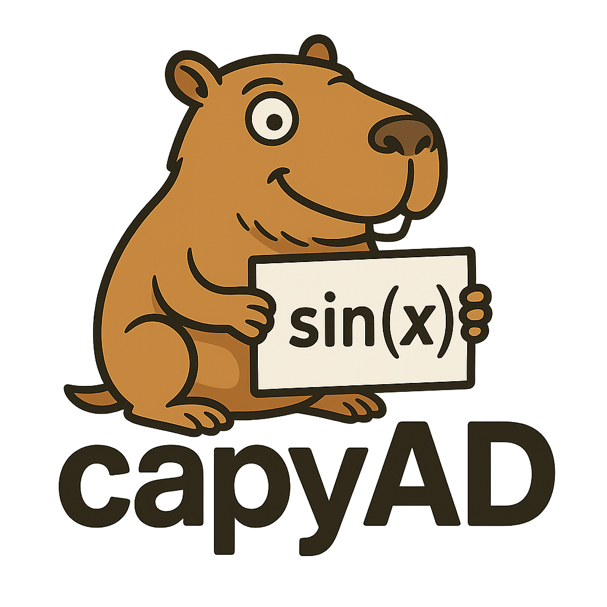

# 🦖 CHOMP — *CHOMP Handles Optimization of Many Problems*

**CHOMP** is a modular **Nonlinear Programming (NLP) solver** that can *chomp through tough constrained problems* using multiple state-of-the-art strategies:

* **SQP (Sequential Quadratic Programming)** — Newton-type steps with globalization (line search, trust region, filter/funnel acceptance).
* **IP (Interior Point)** — log-barrier primal-dual method with slack variables, inspired by **IPOPT**, for smooth handling of inequalities.
* **AUTO** — automatic mode selection depending on problem structure.

CHOMP combines **automatic differentiation**, **sparse linear algebra**, and **advanced regularization** to solve nonlinear constrained optimization problems reliably and efficiently.

---

## ✨ Features

* **Multiple solving strategies**

  * `sqp`: Sequential Quadratic Programming with advanced globalization.
  * `ip`: Interior Point method with slack + log-barrier.
  * `auto`: Automatic mode selection.

* **Constraint handling**

  * Equalities and inequalities.
  * Automatic slack transformation for inequalities in IP mode.

* **Linear algebra backends**

  * Sparse LDLᵀ factorizations via **QDLDL**.
  * Dense/sparse fallbacks using **SciPy**.

* **Robust regularization**

  * Adaptive handling of indefinite or rank-deficient Hessians.
  * Sparsity-preserving regularization strategies.

* **Extensible design**

  * Modular components: `Model`, `Regularizer`, `Stepper`, `KKT`.
  * Easy to plug in new globalization, regularization, or solver backends.

---

## 📦 Installation

```bash
git clone https://github.com/your-org/chomp.git
cd chomp
pip install -e .
```

**Dependencies:**

* Python ≥ 3.9
* NumPy, SciPy
* [qdldl-cpp](https://github.com/oxfordcontrol/qdldl) (exposed via pybind11)

---

## 🚀 Usage

### Define a model

```python
import numpy as np
from chomp import NLPSolver, SQPConfig

# Rosenbrock objective
def rosenbrock(x):
    return (1 - x[0])**2 + 100 * (x[1] - x[0]**2)**2

# Circle inequality: x1² + x2² ≤ 25
c_ineq = [lambda x: x[0]**2 + x[1]**2 - 25]

x0 = np.array([3.0, 2.0])

solver = NLPSolver(rosenbrock, c_ineq=c_ineq, x0=x0, config=SQPConfig())
```

### Run SQP

```python
x_opt, lam, info = solver.solve(mode="sqp")
print("Optimal solution (SQP):", x_opt)
```

### Run Interior Point

```python
x_opt, lam, info = solver.solve(mode="ip")
print("Optimal solution (IP):", x_opt)
```

### Let CHOMP decide (auto mode)

```python
x_opt, lam, info = solver.solve(mode="auto")
```

---

## 🔬 Examples

* **Unconstrained**: Rosenbrock minimization
* **Inequality-constrained**: Branin function + circular constraint
* **Equality-constrained**: Quadratic programming with linear equalities

See [`examples/`](./examples) for runnable demos.

---

## 📖 References

* Nocedal & Wright (2006), *Numerical Optimization*
* Wächter & Biegler (2006), *Primal-Dual Interior Point Filter Line Search Algorithm* (IPOPT)
* Gill, Murray & Wright (1981), *Practical Optimization*

---

## 🛠️ Development Notes

* **Bindings**: `pybind11` exposes **C++ LDLᵀ factorizations** (`qdldl_cpp`) to Python.
* **Modules**:

  * `Model`: automatic differentiation wrapper for objectives/constraints.
  * `Regularizer`: Hessian conditioning and inertia correction.
  * `SQPStepper`: globalization via trust region, line search, filter, funnel.
  * `InteriorPointStepper`: slack/barrier-based primal-dual IPM.
  * `KKT`: sparse KKT system assembly and factorization.